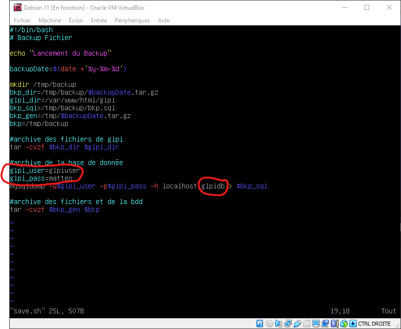

# Mise en place d'une sauvegarde automatique

Pour pouvoir sauvegarder la base de donnée et le GLPI automatiquement il faut tout d'abord créer un fichier .sh avec la commande :  
`touch script.sh`

et y écrire le script suivant : 

        #!/bin/bash
        # Backup Fichier

        echo "lancement du scripts de backup"

        mkdir /tmp/backup

        bkpdate=$(date +'%Y-%m-%d')

        bkp_dir=/tmp/backup/$bkpdate-bkp.tar.gz
        glpi_dir=/var/www/html/glpi
        bkp_sql=/tmp/backup/bkp.sql
        bkp_gen=/tmp/backup-$bkpdate.tar.gz
        bkp=/tmp/backup

        #archive des fichiers de glpi
        tar -cvzf $bkp_dir $glpi_dir

        #archive de la base de donnée
        glpi_user=glpiuser
        glpi_pass=<monmdp>
        mysqldump -u$glpi_user -p$glpi_pass -h localhost glpidb > $bkp_sql

        #archive des fichiers et de la bdd
        tar -cvzf $bkp_gen $bkp

:warning: veillez bien à changer ce qui est entourer en rouge par les informations que vous avez mis.

Ensuite vous allez modifier le crontab pour que le script créer précédement puisse se lancer tout les x temps
``su -``
``sudo crontab -e``

et écrire cette ligne dedans  

``0 0 * * 1-4 su root [SCRIPTPATH]/save.sh``

Cette commande à pour effet de lancer le script à minuit le Lundi, Mardi, Mercredi, Jeudi et pas le vendredi, Samedi, Dimanche pour pouvoir faire des modifications le week-end si jamais il y a des problèmes.  

[<--- Sommaire](https://github.com/Matteo-Grellier/LinuxGLPI) --- Page 7 --- [Conclusion --->](https://github.com/Matteo-Grellier/LinuxGLPI/blob/main/Files/Conclusion.md#conclusion)