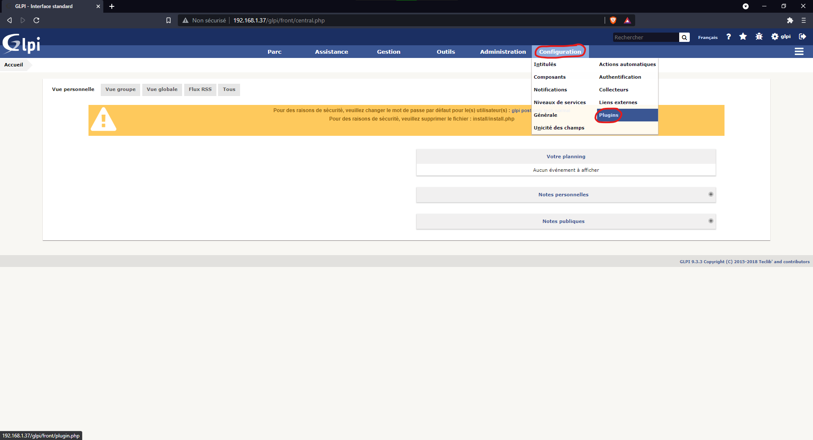
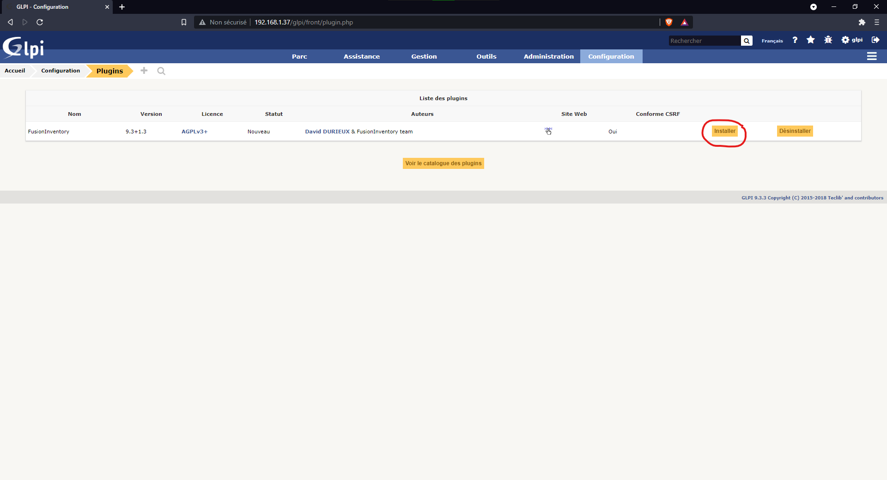
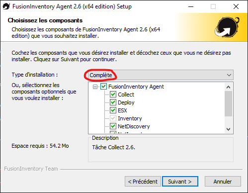
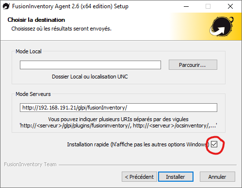
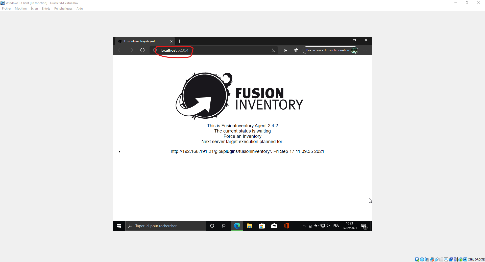

# FusionInventory

- ## Installation du plugin FusionInventory

Tout d'abord, il va falloir télécharger le plugin sur le serveur qui gère le GLPI, ici la Debian.

faites cette suite de commande :
``cd /usr/src``
``wget https://github.com/fusioninventory/fusioninventory-for-glpi/archive/glpi9.3+1.3.tar.gz``
Cette commande permet de télécharger le fichier depuis l'url.
``tar -zxvf glpi9.3+1.3.tar.gz -C /var/www/html/glpi/plugins``
Cette commande permet d'éxtraire/Décompréssez le fichier télécharger pour qu'il puisse être utiliser.

Ensuite, il faut donner les droits d'accès au serveur
``chown -R www-data /var/www/html/glpi/plugins``

Ensuite, on change le nom du fichier pour que le GLPI puisse le voir

``cd /var/www/html/glpi/plugins``
``mv fusioninventory-for-glpi-glpi9.3-1.3/ fusioninventory/``

On peut donc retourner sur l'interface Web et aller dans l'onglet Plugins.  
  

Et installer et acitver le plugin FusionInventory  
  

Le plugin est à présent installer !!!

- ## Installation de FusionInventoryAgent

Ici, on va voir comment faire en sorte qu'une machine cliente puisse envoyer à notre sesrveur GLPI les données sur son appareil.

Il faut tout d'abord aller sur votre machine cliente qui doit être connectée au même réseau que votre serveur GLPI.

Cliquer sur ce [lien](http://fusioninventory.org/documentation/agent/installation) pour télécharger FusionInventoryAgent.

Choississez bien installation complete comme ci-dessous  
  

Continuer jusqu'à l'étape comme montrée ci-dessous vous allez devoir marquer dans ``mode serveur`` l'addresse suivante `http://[IPSERVER]/GLPI/plugins/fusioninventory/`
Elle permet de choisir un serveur chez lequelle envoyer toute les données.
  

- ## Test de l'installation de FusionInventory et GLPI

sur votre vm client sur votre navigateur écrivez cette URL `http://localhost:62354` et une page comme ci-dessous devrait apparaître
  

Cliquez sur `Force an Inventory`.

Et voila, maintenant, sur votre GLPI, vous devriez voir dans l'onglet ``Administration > FusionInventory`` votre vm Client.

[<--- Sommaire](https://github.com/Matteo-Grellier/LinuxGLPI) --- Page 6 --- [Sauvegarde automatique --->](https://github.com/Matteo-Grellier/LinuxGLPI/blob/main/Files/Backup.md#mise-en-place-dune-sauvegarde-automatique)