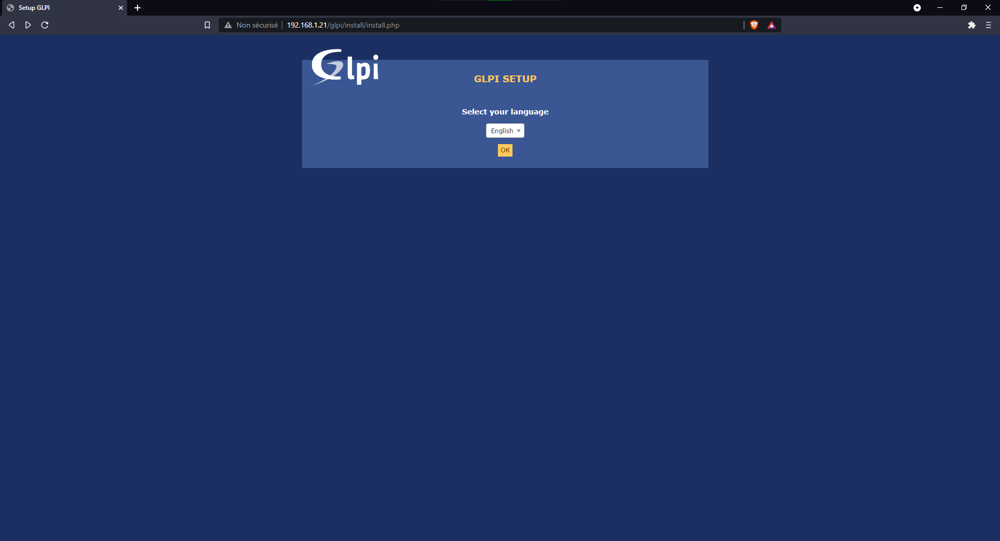
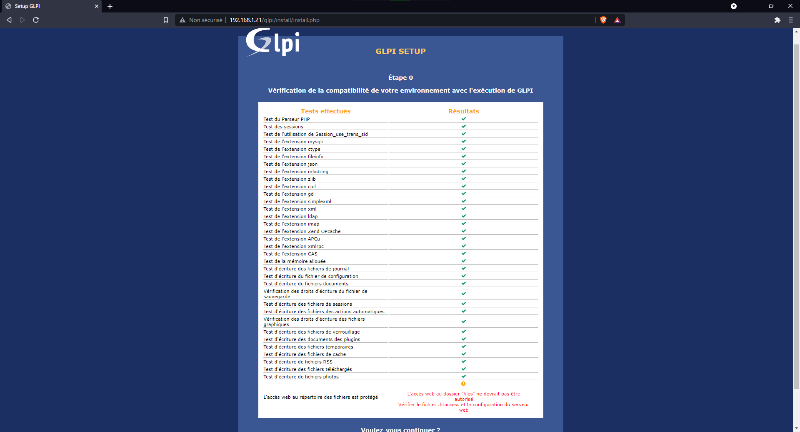
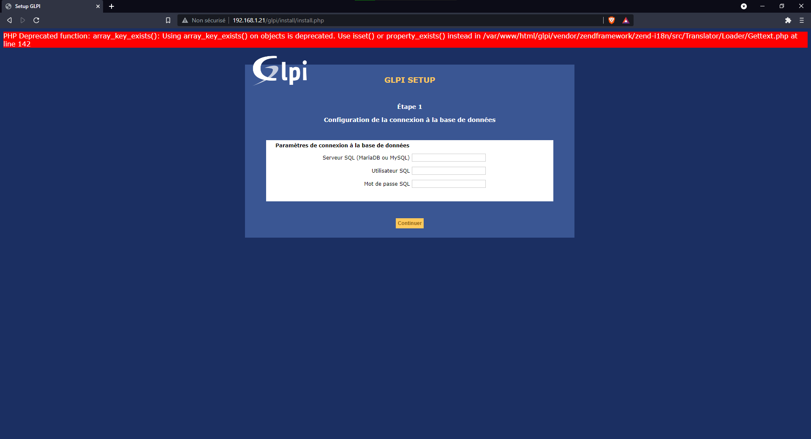
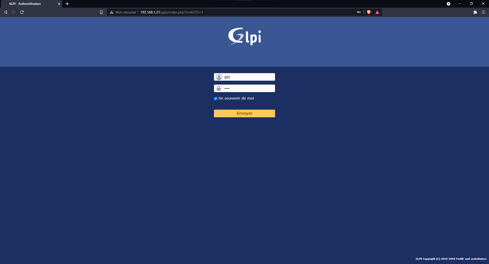
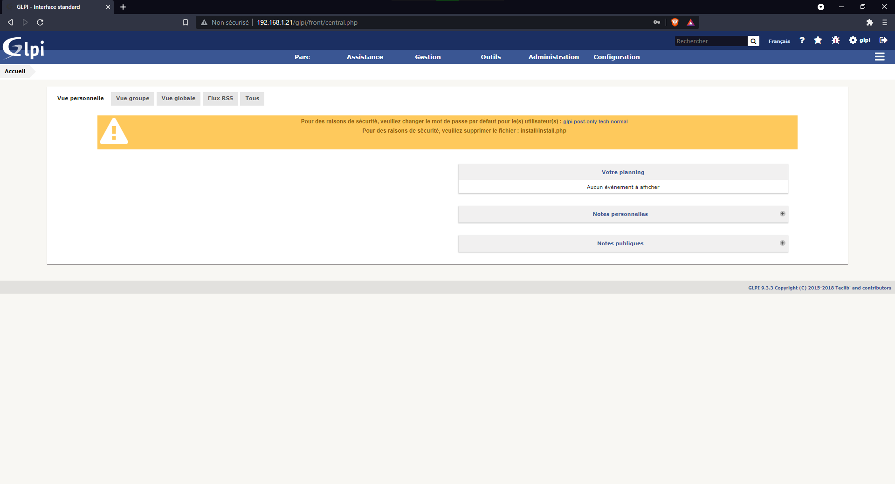

# GLPI

- ## Installation du GLPI

Pour installer écrivez cette sutie de commande :

`cd /usr/src/`
`wget https://github.com/glpi-project/glpi/releases/download/9.3.3/glpi-9.3.3.tgz`
`tar -xvzf glpi-9.3.3.tgz -C /var/www/html`

Pour finir utiliser cette commande:flechedubas:, elle permet de donner les droits du serveur LAMP(Linux, Apache2, Mysql, PHP)
`chown -R www-data /var/www/html/glpi/`

L'installation est dès à présent terminé, vous pouvez allez sur votre navigateur et écrire l'url suivante `http://[VOTRE IP DEBIAN]/GLPI`

Vous arriverez sur cette page :

cliquer sur continuer jusqu'à cette page :

Ici, vérifiez que chaque package est bien installé sinon, installé les packages manquant.
Lorsque ce serat bon, le bouton ``Continuer`` apparaitra en bas de la page.

Ensuite, vous aurez cette page :

Remplissez avec `localhost`, `glpiuser`, `[votre MDP d'accès à la BDD]`

Sur la page suivant, choisissez le nom donné à votre BDD

Continuer jusqu'à devoir vous connecter

## Utilisation du GLPI

L'installation du GLPI est à présent terminée et vous devez vous trouver sur cette page :

Ici, vous avez accès a diférents ongletss qui vous permettes de gérer vote parc informatique

[<--- Sommaire](https://github.com/Matteo-Grellier/LinuxGLPI) Page 5 --- [Plugin FusionInventory --->](https://github.com/Matteo-Grellier/LinuxGLPI/blob/main/Files/FusionInventory.md#installation-du-plugin-fusioninventory)