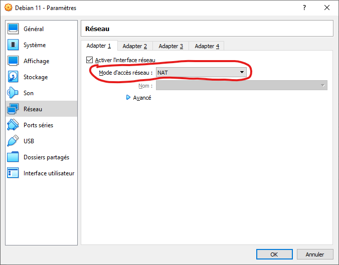
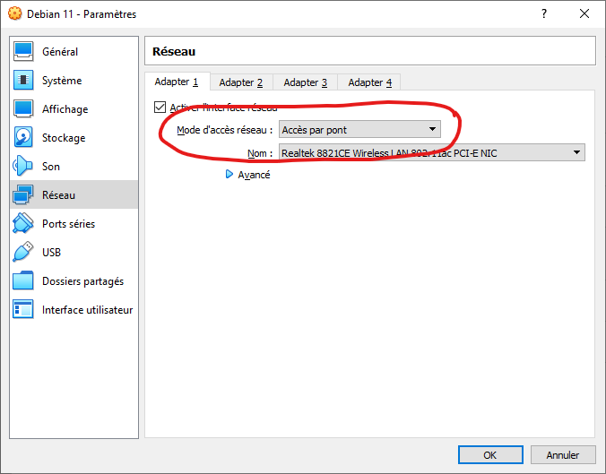

# Mise en place des machines virtuelles et configuration du réseau

## Installation des vm

J'ai installé deux machines virtuelles à l'aide de VirtualBox :  

- Une machine Debian sans interface graphique qui me permet d'héberger ma base de donnée MariaDb et Apache2 (voir cette page pour explication des termes)  

- Une machine Windows qui me permet de simuler une machine cliente avec FusionInventory  
 
## Configuration du réseau  

Dans cette partie il va falloir configurer un réseau privé pour simuler un réseau d'entreprise, c'est à dire un serveur et des clients.  

- Il faut tout d'abord modifier l'accès au réseau n'ont pas par NAT  
  
mais par Bridge  
  

Cela va avoir pour effet de couper internet sur nos vm  
Pour avoir réactiver internet en bridge sur la debian il suffit d'installer Bind9 et de le parametrer.  

- ## BIND9  
  
Pour installer Bind9, il suffit d'utiliser cette commande :  
``apt-get install bind9 dnsutils``  

Pour l'utiliser comme serveur DNS, vous devez modifier le fichier ``/etc/resolv.conf`` et ajouter cette ligne ``nameserver 127.0.0.1``  

Redémarrez votre vm et vous devriez avoir internet même en Bridge  

[<--- Sommaire](https://github.com/Matteo-Grellier/LinuxGLPI) ---Page 3--- [Paquets Nécéssaires --->](https://github.com/Matteo-Grellier/LinuxGLPI/blob/main/Files/InstallPackages.md#installation-des-packages)