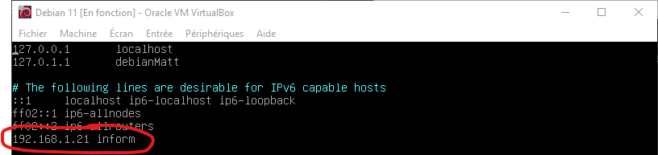
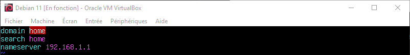
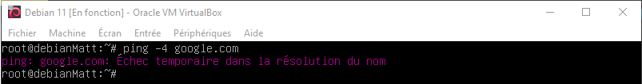

# Configurez un DNS (Domain Name System)

````
✍️ DNS veut dire "Domain Name System", il permet de mettre un nom à la place d'une ip, au lieu de http://216.58.213.174/ ce serait http://www.google.com/. Ca s'appelle la résolution DNS ✍️
````
Pour configurez le DNS et utiliser Inform comme DNS vers notre site il suffit de modifier deux fichiers qui seront `/etc/hosts` et `/etc/resolve.conf`

## /etc/hosts

✍️ Ce fichier permet de définir un DNS, il y'a déja la ligne ``127.0.0.1 localhost``.  
Il permet de dire que lorsque l'on écris ``http://localhost/`` sur un navigateur web, c'est comme si l'on avait écris ``http://127.0.0.1/` ✍️

Il suffit d'écrire sur une nouvelle ligne ``[VotreIPV4] [Nom de domaine souhaitée]`` comme ci-dessous.



## /etc/resolv.conf

✍️ *Ce fichier permet de définir un DNS pour notre Debian.* ✍️



On peut voir que lorsque l'on supprime le fichier et qu'on essaye de ping une addresse, on peut plus communiquer.



````
✍️ A noter que lorsqu'on éteint et rallume la débian, le fichier qu'utilise le serveur permettant la résolution DNS se reconfigure tout seul ✍️
````
