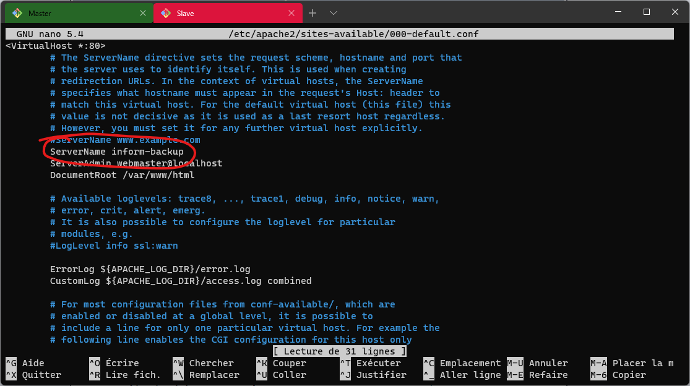
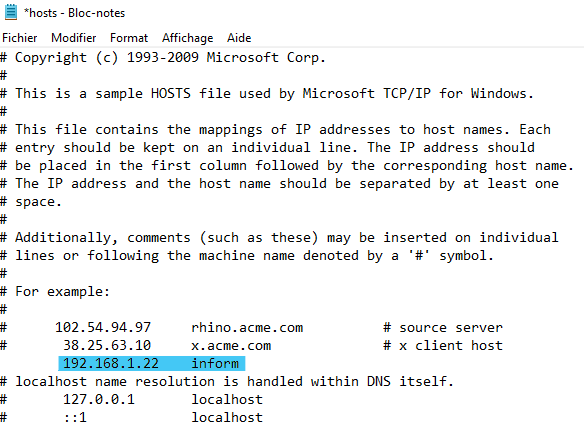
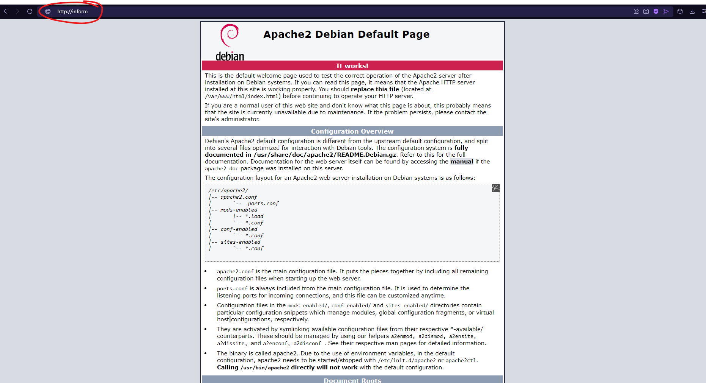
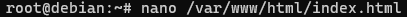

# Configurez un DNS (Domain Name System)

````

✍️ DNS veut dire "Domain Name System",  
il permet de mettre un nom à la place d'une ip, au lieu de http://216.58.213.174/ ce serait http://www.google.com/.   
Ca s'appelle la résolution DNS ✍️

````

Pour configurez le DNS et utiliser Inform comme DNS vers notre site il suffit de modifier certains fichiers qui seront `/etc/hosts`, `/etc/resolve.conf` et `/etc/apache2/sites-available/[name].conf`

## /etc/hosts

On peut modifier ce fichier avec cette commande : `nano /etc/hosts`

✍️ Ce fichier permet de définir un DNS, il y'a déja la ligne ``127.0.0.1 localhost``.  
Il permet de dire que lorsque l'on écris ``http://localhost/`` sur un navigateur web, c'est comme si l'on avait écris ``http://127.0.0.1/` ✍️

Il suffit d'écrire sur une nouvelle ligne ``[VotreIPV4] [Nom de domaine souhaitée]`` comme ci-dessous.


## /etc/resolv.conf

✍️ *Ce fichier permet de définir un serveur DNS pour notre Debian.* ✍️


✍️ On peut voir que lorsque l'on supprime le fichier et qu'on essaye de ping une addresse, on ne peut plus communiquer. ✍️


````
✍️ A noter que lorsqu'on éteint et rallume la débian, le fichier qu'utilise le serveur permettant la résolution DNS se reconfigure tout seul ✍️
````

## /etc/apache2/sites-available/

Dans ce dossier, on va avoir des fichiers `.conf` qui permettent de configurez les serveurs permettant la mise en place d'un dns.
Le fichier important ici est le fichier `000_default.conf`, comme on peut le voir, il est pré-rempli.



Il ne nous restent plus qu'à ajouter la ligne entourer mais vous pouvez remplacer par le nom que vous voulez.

## Test

Vous pouvez testez directement sur votre vm :

1. Si vous n'avez pas de navigateur installée vous utilisez cette commande : ``curl [nom de domaine]`` ou `curl http://[nom de domaine]`
2. Si vous avez un navigateur, il vous suffit d'écrire dans l'url `http://[nom du domaine]`

## Utilisation du DNS sur la machine Host

On peut utiliser le DNS créer sur la vm directement sur la machine host, ici windows. Pour cela il suffit de modifier ce fichier `C:\Windows\System32\drivers\etc\hosts` simplement en y ajoutant l'ip de votre vm suivi du nom de domaine comme ci-dessous :


On peut donc essayer de se connecter au site hébérger par la vm en allant sur un nvaigateur et en marquant ``http://inform``



## Changer le site par défault

Pour l'instant sur votre url, vous avez la page html par défault que Apache génère à son installation. Pour la modifier, il nous suffit juste d'aller éditer ce fichier :
`/var/www/html/index.html`


## Axe d'amélioration

-----

Pour venir à bout de cette étape il fallait comprendre ce qu'était le DNS et son utilité
Il fallait essayer de savoir à quoi servait chaque fichier que l'on modifiait pour éspérer avoir un résultat

-----

<--- [Configurez les services web](ServiceWeb.md) |Page 4| [Certificat SSL](SSL.md) --->
