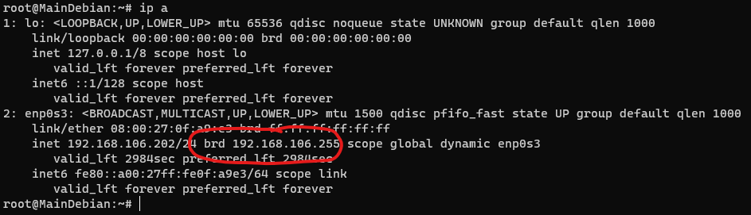
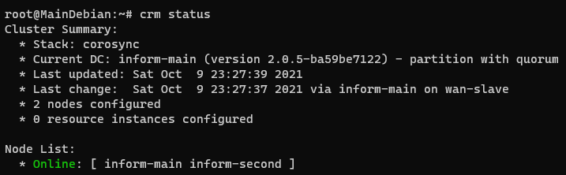
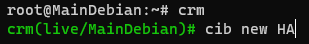
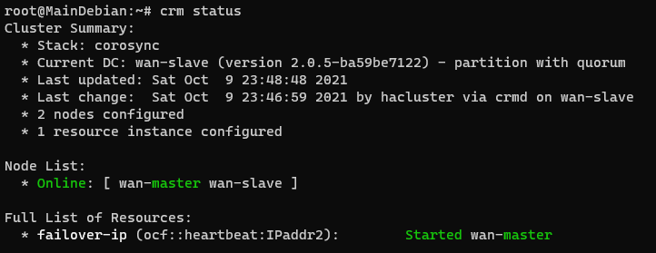

# High Accessibility

## Prérequis

- Dans cette partie on va voir comment mettre en place un serveur secondaire qui va intervenir lorsque le serveur primaire aura des problèmes.
- On va se servir de notre deuxième VM.

Installation des paquets nécéssaires au fonctionnement de Pacemaker et corosync : 
`apt install pacemaker corosync crmsh`

------------

## Installation

✍️ Un Cluster en informatique est un groupe de serveur ✍️

Il va falloir installer 3 packages dont : Pacemaker, Corosync, crmsh

- Pacemaker est un gestionnaire de resource automatisé, ils nous permettrats de détécter lorsqu'un serveur serat défaillants.  
- Corosync est un logiciel open source qui nous permettrat de maintenir notre cluster. En rédémarrant des processus par exemple
- crmsh est un terminal spécial pour entrer des commande pacemaker.


Nous devons ensuite générer une clé d'athentification sur la machien principale pour lier nos deux noeuds

✍️ Un noeud c'est comme cela que sont apellés nos deux VM ici noeud 1 et noeud 2 ✍️


On va copier cette clé vers le deuxième noeud, ici VM-second

  

Il faut maintenant configurer le réseau privé dans le quel nos deux noeuds vont communiquer  

Et pour cela il faut modifier le fichier `corosync.conf`


et y remplacer toutes les lignes par celle ci 👇
🚨 Il faut bien remplacer les différentes zones par vos addresses ip et BROADCAST 🚨

Votre addresse Broadcast se situe ici :


````
logging {
  debug: off
  to_syslog: yes
}
nodelist {
  node {
    name: inform-main
    nodeid: 1
    quorum_votes: 1
    ring0_addr: [IPV4MAIN]
  }
  node {
    name: inform-second
    nodeid: 2
    quorum_votes: 1
    ring0_addr: [IPV4SECOND]
  }
}
quorum {
  provider: corosync_votequorum
}
totem {
  cluster_name: cluster-ha
  config_version: 3
  ip_version: ipv4
  secauth: on
  version: 2
  interface {
    bindnetaddr: [BROADCAST]
    ringnumber: 0
  }
}
````

Il faut ensuite copier ce fichier vers le noeud secondaire 


Avant de pouvoir tester les changements, il faut redémarrer corosync avec cette commande :
`service corosync restart`

pour voir le statut de botre cluster, il suffit d'écrire `crm_mon --one-shot -V`

On peut voir que les deux nodes sont ONLINE et donc peuvent communiquer entre eux.



## Créer une ip failover 

On va maintenant voir comment configurez une ip virtuelle liée à une ressource et pour cela on va créer une nouvelle configuration

Pour commencer il faut créer une nouvelle configuration 



Ensuite on désactive certaine fonctionnalité pas utile pour ce tp : 

  


On définit l'ip ?

On peut voir avec la commande `crm_mon --one-shot -V` qu'une nouvelle ressource à été rajouté.

