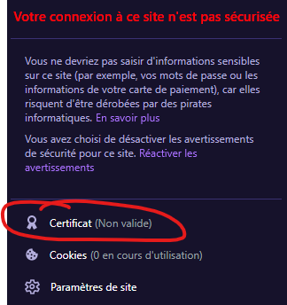

# Certificat SSL

## Prérequis

--------------

- Fortement conséillé de se connecter en ssh ç sa vm pour cette étape car beaucoup de commande vont être écrite

- installer openssl : apt-get install openssl

✍️ openSSL permet de créer un certificat SSL ✍️

✍️ SSL (Secure Socket Layer) permet de sécurisé un site web notemment en prouvant que les données entrées sur ce site sont chiffrées et donc sécuriser
mais aussi que vous êtes bien sur le bon site et non pas sur un site pouvant récupérer vos données à des fins mauvaises ex: données de carte bancaire ✍️

--------------

## Installation d'un certificat SSL

Pour cette étape on va chercher à créer un certificat ssl auto-signée pour notre site qui ne serat pas validé car notre site ?

Pour commencer on va se placer dans le répértoire ssl (créer lors de l'installation du package openSSL) : `cd /etc/ssl`

On va créer un répértoire `crt` ou l'on va stocker notre certificat

se placer dedans : cd /crt

On va maitenant générer notre certificat ssl : 
``openssl req -x509 -nodes -days 365 -newkey rsa:2048 -keyout inform.key -out inform.crt`` 

Maintenant que notre certificat est générer on va aller l'attribuer à notre site.

`cd /etc/apache2/sites-available `

Pour ensuite supprimer le fichier de configuration par défault : `rm default-ssl.conf`

et en créer un nouveau, propre à notre site.

``nano inform.conf``

On va y ajouter ce bout de code permettant d'attribuer aux ports 80 et 443 des infos concernant notre site, le port 80 pour le sinformations concernant notre serveur HTTP et le port 443 pour permettre à notre site d'être en HTTPS

````sh 
<VirtualHost *:80>
        ServerName inform
        Redirect permanent / https://inform
</VirtualHost>

<VirtualHost *:443>
        DocumentRoot /var/www/html
        ServerName inform
        SSLEngine on
        SSLCertificateFile /etc/ssl/crt/inform.crt
        SSLCertificateKeyFile /etc/ssl/crt/inform.key
</VirtualHost>
````

Il ne nous reste plus qu'a activer le ssl : `sudo a2enmod ssl` et le fichier conf `sudo a2enmod inform.conf`

## test

Maitenant sur le navigateur lorsque vous rentrez : https://inform
Votre site devrez apparaître avec le logo du petit cadenas ou en tout cas il devrait détécter un certificat



<--- [Nom de domaine](DNS.md) |Page 5| [Conclusion](Conclusion.md) --->