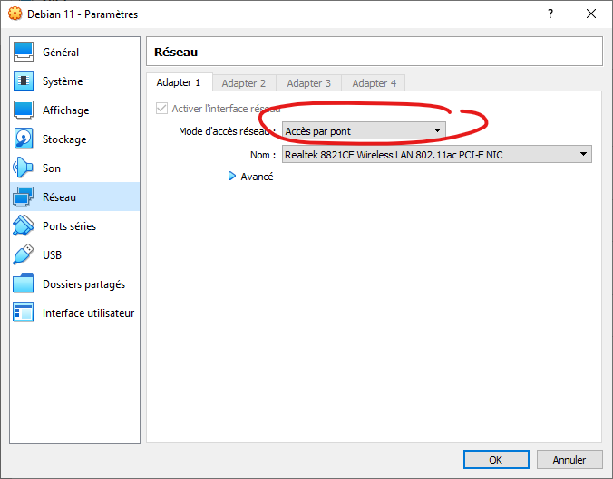
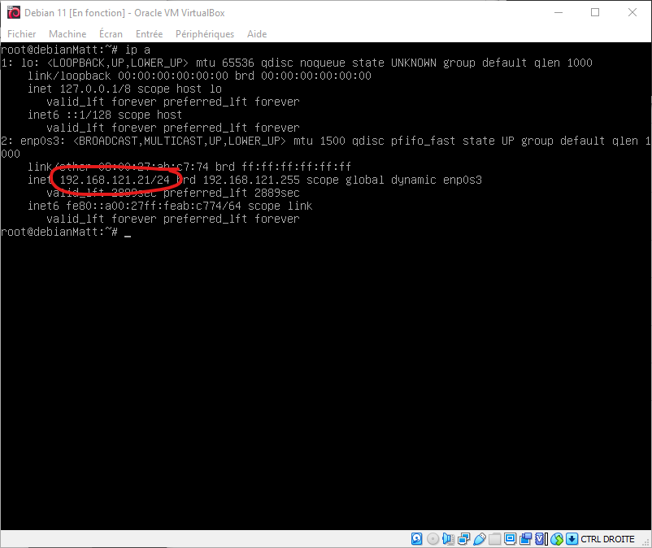

# Configurer le service réseau sur la vm principale

## Prérequis | Informations utiles 🔧

Pour ce tp je préfère me connecter à mon réseaux mobile en partage car la wifi sécurisée d'ynov pourrais poser problème.  

## Adresse IP  

Tout d'abord je change le mode d'accès réseau en le mettant en Bridgee au lieu de NAT  
````
✍️ NAT veut dire (network adress translation) elle permet à la machine virtuelle de recevoir une ip exactement comme si mon réseau mobile attribuait sur la machine Host une addresse ipv4, en comparaison Bridge permet de connecter la vm sur le même réseau que la machine Host, utilisé par exemple lorsque l'on veut faire un réseau privée avec d'autres vm ✍️
````



Sur la Débian principale il va falloir récupérer l'ipv4 qu'il faudrat réutiliser durant le tp avec la commande ``ip a``  


<--- [Mise en place des machine virtuelles](VM.md) |Page 2| [Configurez les serices web](ServiceWeb.md) --->