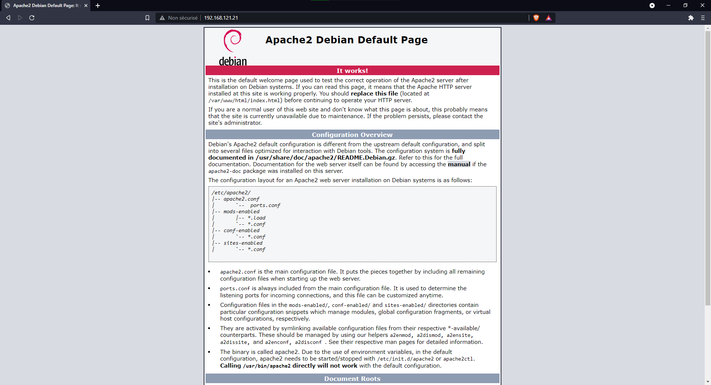
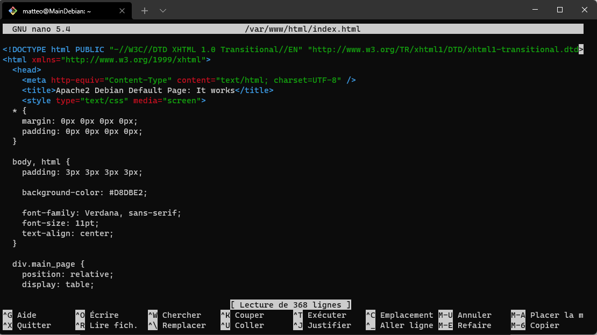

# Configurez les services WEB

## Prérequis | Informations utiles 🔧

On va avoir besoin du package apache2  

```sh
apt-get install apache2
```

redémarrer les services apache2 pour être sûr que tout fonctionne

```sh
service apache2 restart
```

OU  
````
✍️ J'ai pu voir qu'avec certains membres de mon groupe, la commande du dessus ne fonctionnait pas.  
La commande suivante permet de faire la même chose mais d'une manière différente ✍️
````

```sh
systemctl apache2 restart
```

## Création d'un site web

Il va donc falloir aller sur cette url avec votre navigateur

```http
http://[VOTREIPV4]
```

Cela va avoir pour effet d'afficher cette page.


````
✍️ En installant apache2 une page de guide est directement héberger sur votre LocalHost,  
cette page explique les fondamentaux de l'utilisation d'apache dont comment modifier cette page qui va nous servir de page web ✍️
````

Il va falloir aller modifier le fichier se trouvant ici `/var/www/html/index.html`  

````
✍️ VirtualBox ne permettant pas de modifier un fichier avec l'aide des raccourcis clavier,  
je conseille d'utiliser le ssh pour pouvoir modifier ce fichier à partir de votre machine Host et avoir accès aux raccourcis clavier ✍️
````

```sh
nano /var/www/html/index.html
```

Sur l'image ci-dessous vous pouvez voir le fichier contenant le code source de la page guide apache.


Vous n'avez plus qu'à tout supprimer et écrire ce que vous voulez, dont du code html et même css.

Axe d'amélioration
------
Le plus compliquée sur cette partie à été de comprendre réellement l'utilité d'Apache2 et son fonctionnement.

------

<--- [Configurez les services réseaux](ServiceReseau.md) |Page 3| [Nom de domaine](DNS.md) --->