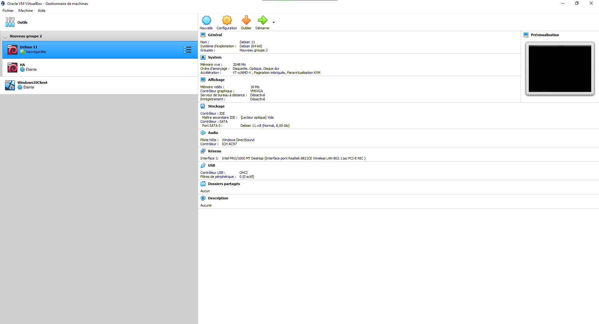

# Mise en place des machine virtuelles 💻

## Prérequis | Informations utiles 🔧

> Posséder Virtual Box ou VMware, pour ce tp j'utilise VirtualBOx.

-----
✍️ *Différence entre VMware et VirtualBox* ✍️  
VMware est un logiciel plus complexe a prendre en main du fait du manque de démarche à suivre lors de l'installation.  
Il est aussi plus performant que VB pour faire tourner des vm.  

Mais VirtualBox permet simplement d'arriver au boût des différents TP.  

-----

## Installation des machines virtuelles

Pour ce tp ils nous faudrat deux vm Débian *ℹ️ la deuxième va nous servir vers la fin du tp ℹ️*  

Dans VirtualBox on peut voir que j'ai bien 2 VM Debian disponible.  

✍️ *Il vaut mieux appeller la deuxième ``HA`` pour ne pas confondre avec la première* ✍️  

